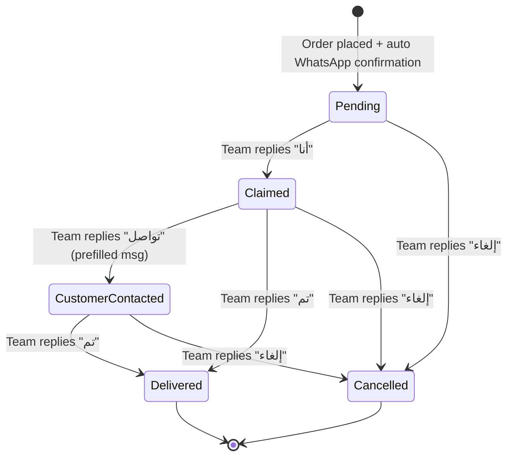

# PRD-004: Order Management via WhatsApp

| Field            | Value                  |
| ---------------- | ---------------------- |
| **Author**       | Family Stationary Team |
| **Status**       | Draft                  |
| **Priority**     | P0                     |
| **Created**      | 2026-02-11             |
| **Last Updated** | 2026-02-11             |

---

## 1. Overview

When a customer places an order on the website, two things happen automatically:

1. **Customer receives an instant WhatsApp confirmation** with their order details
2. **Order details are dispatched to a dedicated Fulfillment Group** on WhatsApp

Any member of the fulfillment team who has joined this group can view the order, claim it, **contact the customer with a prefilled delivery confirmation message**, and coordinate delivery — no separate admin panel needed.

### 1.1 Goals

- Instant order notifications to the fulfillment team via WhatsApp
- Clear, well-formatted order messages in Arabic
- Enable team coordination (claim orders, mark as delivered)
- Simple and reliable — no app installation required for the fulfillment team

### 1.2 Non-Goals

- Full order management dashboard (Phase 2)
- Automated delivery routing or logistics
- Customer-facing order tracking page (Phase 2)
- Payment processing (COD only — see PRD-005)

---

## 2. User Stories

| ID    | As a…                   | I want to…                                                                       | So that…                                            |
| ----- | ----------------------- | -------------------------------------------------------------------------------- | --------------------------------------------------- |
| US-01 | Fulfillment team member | Receive a WhatsApp message when a new order is placed                            | I can prepare the order for delivery                |
| US-02 | Fulfillment team member | See all order details (items, quantities, customer info, address) in the message | I have everything needed to fulfill the order       |
| US-03 | Fulfillment team member | Reply "أنا" (Me) to claim an order                                               | The team knows who is handling it                   |
| US-04 | Fulfillment team member | Send "تم" (Done) to mark an order as delivered                                   | The system and team know the order is complete      |
| US-05 | Customer                | **Automatically** receive a WhatsApp confirmation the moment I place an order    | I have immediate proof that my order was received   |
| US-06 | Founder                 | See a daily summary of orders                                                    | I can track business performance                    |
| US-07 | Fulfillment team member | Tap a link to contact the customer with a prefilled WhatsApp message             | I can confirm delivery date without typing manually |
| US-08 | Fulfillment team member | Only need to enter the delivery date — the rest of the message is automatic      | Contacting the customer is fast and consistent      |

---

## 3. Architecture

```
┌────────────────┐
│   Customer     │
│   (Website)    │
└───────┬────────┘
        │ Places order
        ▼
┌────────────────────┐
│  Order Service     │
│  (Backend API)     │
└───────┬────────────┘
        │ Order created
        ├──────────────────────┐
        ▼                      ▼
┌──────────────────┐    ┌──────────────────┐
│ WhatsApp:        │    │ WhatsApp:        │
│ Fulfillment      │    │ Customer         │
│ Group Message    │    │ Confirmation     │
└──────────────────┘    └──────────────────┘
        │
        ▼
┌──────────────────┐
│ Team replies:    │
│ "أنا" → Claimed  │
│ "تم"  → Delivered│
└──────────────────┘
```

---

## 4. Functional Requirements

### 4.1 Order Notification to Fulfillment Group

| Req ID | Requirement                                                                         | Priority |
| ------ | ----------------------------------------------------------------------------------- | -------- |
| FR-01  | Send a structured WhatsApp message to the fulfillment group when an order is placed | P0       |
| FR-02  | Message must be in Arabic with clear formatting                                     | P0       |
| FR-03  | Include: order number, timestamp, customer name, phone, delivery address            | P0       |
| FR-04  | Include: itemized product list (name, qty, unit price, line total)                  | P0       |
| FR-05  | Include: order total and payment method (COD)                                       | P0       |
| FR-06  | Include: any customer notes                                                         | P1       |

### 4.2 Order Message Format

```
🛒 طلب جديد #1042

📅 ١١ فبراير ٢٠٢٦ — ١٠:٣٥ م

👤 العميل: أحمد محمد
📱 الجوال: +966 5X XXX XXXX
📍 العنوان: حي الروضة، شارع الملك فهد، الرياض

━━━━━━━━━━━━━━━━━━
📦 المنتجات:
  • دفتر ملاحظات A5 × 2 — 30 ر.س
  • أقلام حبر جاف (عبوة 10) × 1 — 15 ر.س
  • مجموعة ألوان مائية × 1 — 45 ر.س
━━━━━━━━━━━━━━━━━━
💰 الإجمالي: 120 ر.س
💵 الدفع: عند الاستلام

📝 ملاحظات: يرجى التغليف كهدية

━━━━━━━━━━━━━━━━━━
للاستلام: رد بـ "أنا"
للتواصل مع العميل: رد بـ "تواصل ١٠٤٢"
بعد التوصيل: رد بـ "تم ١٠٤٢"
```

### 4.3 Order Claiming & Status Updates

| Req ID | Requirement                                                                 | Priority |
| ------ | --------------------------------------------------------------------------- | -------- |
| FR-07  | When a team member replies "أنا" (or "انا"), assign the order to them       | P0       |
| FR-08  | Send a confirmation message: "✅ تم استلام الطلب #1042 بواسطة [Name]"       | P0       |
| FR-09  | When a team member replies "تم [order number]", mark the order as delivered | P0       |
| FR-10  | Send delivery confirmation: "🎉 تم توصيل الطلب #1042"                       | P0       |
| FR-11  | Prevent double-claiming (if already claimed, notify accordingly)            | P1       |
| FR-12  | Support "إلغاء [order number]" to cancel an order with a reason             | P1       |

### 4.4 Customer Notifications (Automatic)

| Req ID | Requirement                                                                              | Priority |
| ------ | ---------------------------------------------------------------------------------------- | -------- |
| FR-13  | **Immediately** send order confirmation to customer's WhatsApp upon order placement      | P0       |
| FR-14  | Confirmation includes: order number, items summary, total, payment method, store contact | P0       |
| FR-15  | Confirmation is fully automatic — no human action required                               | P0       |
| FR-16  | Notify customer when order is out for delivery (when claimed)                            | P1       |
| FR-17  | Notify customer when order is delivered                                                  | P2       |

#### Customer Confirmation Message Format

```
بسم الله الرحمن الرحيم

✅ تم تأكيد طلبك — #1042

📦 المنتجات:
  • دفتر ملاحظات A5 × 2 — 30 ر.س
  • أقلام حبر جاف (عبوة 10) × 1 — 15 ر.س

💰 الإجمالي: 120 ر.س
💵 الدفع: عند الاستلام
📍 التوصيل إلى: حي الروضة، الرياض

سيتواصل معك فريقنا قريباً لتأكيد موعد التوصيل.
شكراً لتسوقك معنا! 🌙
```

### 4.5 Fulfillment Team → Customer Contact (Prefilled Message)

When a fulfillment team member claims an order and is ready to coordinate delivery, they can contact the customer using a **prefilled WhatsApp message**. The team member only needs to enter the **expected delivery date** — the rest of the message is generated automatically.

| Req ID | Requirement                                                                                       | Priority |
| ------ | ------------------------------------------------------------------------------------------------- | -------- |
| FR-18  | When team replies "تواصل [order#]", system generates a `wa.me` deep link with a prefilled message | P0       |
| FR-19  | Prefilled message includes: greeting, order number, items summary, and a placeholder for the date | P0       |
| FR-20  | Team member enters only the delivery date — the rest is auto-filled                               | P0       |
| FR-21  | The `wa.me` link opens WhatsApp with the customer's number and the prefilled text                 | P0       |
| FR-22  | After sending, team replies "تم_تواصل [order#]" to log the contact in the system                  | P1       |

#### Prefilled Contact Message Format

When a team member replies "تواصل 1042", they receive a clickable link that opens WhatsApp with this prefilled message:

```
السلام عليكم {اسم العميل} 👋

نحن من قرطاسية العائلة بخصوص طلبك #1042.

📦 طلبك يتضمن:
  • دفتر ملاحظات A5 × 2
  • أقلام حبر جاف (عبوة 10) × 1

📍 التوصيل إلى: {عنوان العميل}
💰 المبلغ المستحق: 120 ر.س (الدفع عند الاستلام)

🗓️ موعد التوصيل المتوقع: [____أدخل التاريخ هنا____]

هل الموعد مناسب لك؟
شكراً لثقتك بنا! 🌙
```

> [!NOTE]
> The team member receives a `wa.me/{customer_phone}?text={prefilled_message}` link. They tap it, WhatsApp opens with the message ready, they replace the date placeholder, and send.

### 4.6 Daily Summary

| Req ID | Requirement                                                         | Priority |
| ------ | ------------------------------------------------------------------- | -------- |
| FR-23  | Send a daily summary message to the fulfillment group at end of day | P1       |
| FR-24  | Summary includes: total orders, fulfilled, pending, total revenue   | P1       |

---

## 5. Order Data Model

| Field                   | Type                     | Description                                                                              |
| ----------------------- | ------------------------ | ---------------------------------------------------------------------------------------- |
| `id`                    | UUID                     | Unique order identifier                                                                  |
| `order_number`          | Integer (auto-increment) | Human-readable order number                                                              |
| `customer_name`         | String                   | Customer's name                                                                          |
| `customer_phone`        | String                   | Customer's WhatsApp number (validated as active WhatsApp account)                        |
| `delivery_address`      | Text                     | Full delivery address                                                                    |
| `items`                 | JSON Array               | Order items (product_id, name, qty, price)                                               |
| `subtotal`              | Decimal                  | Sum of line totals                                                                       |
| `total`                 | Decimal                  | Final total                                                                              |
| `payment_method`        | Enum                     | `cod` (cash on delivery)                                                                 |
| `status`                | Enum                     | `pending`, `claimed`, `customer_contacted`, `out_for_delivery`, `delivered`, `cancelled` |
| `claimed_by`            | String (nullable)        | Phone/name of team member who claimed                                                    |
| `expected_delivery`     | Date (nullable)          | Expected delivery date (set when team contacts customer)                                 |
| `customer_contacted_at` | Timestamp (nullable)     | When the fulfillment team contacted the customer                                         |
| `notes`                 | Text (nullable)          | Customer notes                                                                           |
| `created_at`            | Timestamp                | When order was placed                                                                    |
| `updated_at`            | Timestamp                | Last status change                                                                       |
| `delivered_at`          | Timestamp (nullable)     | When delivery was confirmed                                                              |
| `confirmation_sent`     | Boolean                  | Whether automatic WhatsApp confirmation was sent to customer                             |

---

## 6. Order Status Flow



---

## 7. Non-Functional Requirements

| Req ID | Requirement                                          | Target                            |
| ------ | ---------------------------------------------------- | --------------------------------- |
| NFR-01 | Order notification delivery time                     | < 10 seconds after checkout       |
| NFR-02 | WhatsApp message delivery reliability                | ≥ 99%                             |
| NFR-03 | All messages in Arabic                               | 100%                              |
| NFR-04 | Support for Arabic numerals (Eastern Arabic) display | Optional (use Western by default) |
| NFR-05 | Order data retention                                 | ≥ 12 months                       |

---

## 8. Failure Handling

| Scenario                            | Action                                                     |
| ----------------------------------- | ---------------------------------------------------------- |
| WhatsApp API is down                | Queue the message, retry with exponential backoff          |
| Message fails to send               | Log error, alert founders, provide fallback (email or SMS) |
| Order not claimed within 30 minutes | Send a reminder message to the group                       |
| Duplicate claim attempt             | Reply: "⚠️ الطلب مستلم مسبقاً بواسطة [Name]"               |

---

## 9. Dependencies

| Dependency                            | PRD                                  |
| ------------------------------------- | ------------------------------------ |
| Checkout flow triggers order creation | PRD-005                              |
| Product details in order              | PRD-001                              |
| WhatsApp Business API                 | Infrastructure (shared with PRD-002) |

---

## 10. Success Metrics

| Metric                              | Target       |
| ----------------------------------- | ------------ |
| Order notification delivery rate    | ≥ 99%        |
| Average time to claim an order      | < 15 minutes |
| Order fulfillment rate              | ≥ 95%        |
| Customer confirmation delivery rate | ≥ 99%        |

---

## 11. Open Questions

1. Should the fulfillment group be on WhatsApp Groups or WhatsApp Communities?
2. What is the expected delivery area/radius?
3. Should we assign orders automatically in a round-robin fashion vs. first-come-first-serve?
4. How do we handle partial fulfillment (some items out of stock after order)?
5. Should there be a timeout after which unclaimed orders are escalated to founders?
