# PRD-005: Cash on Delivery Checkout Flow

| Field            | Value                  |
| ---------------- | ---------------------- |
| **Author**       | Family Stationary Team |
| **Status**       | Draft                  |
| **Priority**     | P0                     |
| **Created**      | 2026-02-11             |
| **Last Updated** | 2026-02-11             |

---

## 1. Overview

The checkout flow enables customers to complete their purchase using **Cash on Delivery (COD)** as the only payment method in Phase 1. The flow is designed to be quick, mobile-friendly, and entirely in Arabic — requiring no account creation.

### 1.1 Goals

- Frictionless guest checkout (no registration required)
- COD as the sole payment method (simple and trusted in the target market)
- Collect minimal but sufficient delivery information
- Trigger order notification to the fulfillment team (PRD-004)

### 1.2 Non-Goals

- Online payment (credit card, Apple Pay, etc.) — Phase 2
- User accounts & order history — Phase 2
- Delivery fee calculation — Phase 1 uses flat rate or free delivery
- Coupon / discount codes — Phase 2

---

## 2. User Stories

| ID    | As a…    | I want to…                                                                   | So that…                                 |
| ----- | -------- | ---------------------------------------------------------------------------- | ---------------------------------------- |
| US-01 | Customer | Review my cart before checking out                                           | I can confirm my order is correct        |
| US-02 | Customer | Enter my delivery details (name, phone, address) without creating an account | I can quickly complete my purchase       |
| US-03 | Customer | See the total cost including any delivery fee                                | I know exactly what I'll pay at the door |
| US-04 | Customer | Confirm my order with one tap                                                | My order is submitted                    |
| US-05 | Customer | Receive a WhatsApp confirmation with my order details                        | I have proof of my order                 |
| US-06 | Customer | Have my info pre-filled if I've ordered before (via localStorage)            | Repeat orders are even faster            |

---

## 3. Checkout Flow

```mermaid
flowchart TD
    A["🛒 Cart Review"] --> B["📋 Delivery Info Form"]
    B --> C["📝 Order Summary"]
    C --> D{"✅ Confirm Order?"}
    D -- Yes --> E["⏳ Processing..."]
    E --> F["🎉 Order Confirmed"]
    F --> G["📱 WhatsApp Confirmation Sent"]
    F --> H["📨 Fulfillment Group Notified"]
    D -- No --> B
```



---

## 4. Functional Requirements

### 4.1 Cart Review (Step 1)

| Req ID | Requirement                                                                   | Priority |
| ------ | ----------------------------------------------------------------------------- | -------- |
| FR-01  | Display all cart items: product image, name, unit price, quantity, line total | P0       |
| FR-02  | Allow quantity adjustment (±) and item removal                                | P0       |
| FR-03  | Show subtotal                                                                 | P0       |
| FR-04  | Show delivery fee (flat rate or free)                                         | P0       |
| FR-05  | Show grand total                                                              | P0       |
| FR-06  | "Proceed to Checkout" button                                                  | P0       |
| FR-07  | Empty cart state with "Continue Shopping" link                                | P0       |

### 4.2 Delivery Information (Step 2)

| Req ID | Requirement                                                                                                                                                         | Priority |
| ------ | ------------------------------------------------------------------------------------------------------------------------------------------------------------------- | -------- |
| FR-08  | Full name (Arabic input supported)                                                                                                                                  | P0       |
| FR-09  | WhatsApp phone number (with country code pre-filled)                                                                                                                | P0       |
| FR-09a | **Real-time WhatsApp number validation**: verify the entered number is a valid, active WhatsApp account as the user types (debounced, after full number is entered) | P0       |
| FR-09b | Show inline validation status: ✅ green checkmark if valid WhatsApp number, ❌ red error if not on WhatsApp                                                         | P0       |
| FR-09c | Block checkout progression until WhatsApp number is validated                                                                                                       | P0       |
| FR-09d | Validation uses WhatsApp Business API `contacts` endpoint to verify number existence                                                                                | P0       |
| FR-10  | City / Area selection (dropdown)                                                                                                                                    | P0       |
| FR-11  | Street address (free text, Arabic)                                                                                                                                  | P0       |
| FR-12  | Building / apartment details                                                                                                                                        | P1       |
| FR-13  | Landmark or additional directions (optional)                                                                                                                        | P1       |
| FR-14  | Order notes (optional, e.g. "gift wrapping")                                                                                                                        | P1       |
| FR-15  | Auto-fill from localStorage if returning customer                                                                                                                   | P1       |
| FR-16  | Client-side validation with Arabic error messages                                                                                                                   | P0       |
| FR-17  | Phone number format validation (client-side, instant)                                                                                                               | P0       |

### 4.3 Order Summary (Step 3)

| Req ID | Requirement                                                                | Priority |
| ------ | -------------------------------------------------------------------------- | -------- |
| FR-18  | Display complete order: items, delivery info, payment method (COD), totals | P0       |
| FR-19  | "Edit" links to go back and modify info                                    | P0       |
| FR-20  | Payment method shown as "الدفع عند الاستلام" (Cash on Delivery)            | P0       |
| FR-21  | "Confirm Order" button with loading state                                  | P0       |

### 4.4 Order Confirmation (Step 4)

| Req ID | Requirement                                               | Priority |
| ------ | --------------------------------------------------------- | -------- |
| FR-22  | Success screen with order number and summary              | P0       |
| FR-23  | "تم تأكيد طلبك" (Your order is confirmed) message         | P0       |
| FR-24  | Estimated delivery timeframe                              | P1       |
| FR-25  | "Continue Shopping" button                                | P0       |
| FR-26  | WhatsApp confirmation sent to customer's number (PRD-004) | P0       |
| FR-27  | Clear the cart after successful order                     | P0       |
| FR-28  | Save customer info to localStorage for future orders      | P1       |

---

## 5. Form Validation Rules

| Field   | Rule                              | Error Message (Arabic)                                        |
| ------- | --------------------------------- | ------------------------------------------------------------- |
| Name    | Required, min 3 chars             | الرجاء إدخال الاسم الكامل                                     |
| Phone   | Required, valid phone format      | الرجاء إدخال رقم جوال صحيح                                    |
| Phone   | Real-time WhatsApp validation     | هذا الرقم غير مسجل في واتساب (This number is not on WhatsApp) |
| Phone   | Validation in progress            | جارٍ التحقق... (Verifying…) — shown as spinner                |
| City    | Required (selected from dropdown) | الرجاء اختيار المدينة                                         |
| Address | Required, min 10 chars            | الرجاء إدخال العنوان كاملاً                                   |

---

## 6. API Endpoints

| Endpoint                 | Method | Description                                                                        |
| ------------------------ | ------ | ---------------------------------------------------------------------------------- |
| `/api/orders`            | POST   | Create a new order                                                                 |
| `/api/orders/:id`        | GET    | Get order details (by order number)                                                |
| `/api/delivery/areas`    | GET    | Get available delivery areas/cities                                                |
| `/api/validate/whatsapp` | POST   | Real-time WhatsApp number validation (accepts `{phone}`, returns `{valid, wa_id}`) |

### 6.1 Create Order Request

```json
{
  "items": [{ "product_id": "uuid", "quantity": 2 }],
  "customer": {
    "name": "أحمد محمد",
    "phone": "+966512345678",
    "city": "الرياض",
    "address": "حي الروضة، شارع الملك فهد",
    "building": "عمارة 12، شقة 3",
    "landmark": "بجانب مسجد النور",
    "notes": "يرجى التغليف كهدية"
  },
  "payment_method": "cod"
}
```

---

## 7. Non-Functional Requirements

| Req ID | Requirement                                                    | Target                                          |
| ------ | -------------------------------------------------------------- | ----------------------------------------------- |
| NFR-01 | Checkout completion time (3 steps)                             | < 2 minutes for first-time, < 30s for returning |
| NFR-02 | Cart data persistence                                          | localStorage (survives refresh)                 |
| NFR-03 | Order creation API response time                               | < 2 seconds                                     |
| NFR-04 | All form labels, placeholders, and errors in Arabic            | 100%                                            |
| NFR-05 | Mobile-first form design (large inputs, proper keyboard types) | Required                                        |
| NFR-06 | Prevent duplicate order submission                             | Required (debounce + idempotency key)           |

---

## 8. Edge Cases

| Scenario                                  | Handling                                                      |
| ----------------------------------------- | ------------------------------------------------------------- |
| Product goes out of stock during checkout | Show error, offer to remove item or continue without it       |
| Price changes between cart and checkout   | Use price at time of checkout, display the updated price      |
| Network failure during order submission   | Show retry button, don't clear form data                      |
| Duplicate submission (double-tap)         | Idempotency key prevents duplicate orders                     |
| Empty cart accessing checkout             | Redirect to homepage with message                             |
| WhatsApp validation API is down           | Fall back to format-only validation, log for manual follow-up |
| Number is valid phone but not on WhatsApp | Show error, suggest using a WhatsApp-registered number        |

---

## 9. Dependencies

| Dependency                             | PRD     |
| -------------------------------------- | ------- |
| Product data and pricing               | PRD-001 |
| Order notification to fulfillment team | PRD-004 |
| WhatsApp confirmation to customer      | PRD-004 |
| Design system (forms, buttons, RTL)    | PRD-006 |

---

## 10. Success Metrics

| Metric                             | Target      |
| ---------------------------------- | ----------- |
| Checkout completion rate           | ≥ 60%       |
| Average checkout time (first-time) | < 2 minutes |
| Order placement errors             | < 1%        |
| Customer confirmation delivery     | ≥ 99%       |

---

## 11. Future Considerations (Phase 2)

- Online payment integration (Mada, Apple Pay, credit cards)
- User accounts with order history
- Address book / saved addresses
- Delivery scheduling (choose date/time)
- Coupon / promo code system
- Delivery fee by zone

---

## 12. Open Questions

1. What are the delivery areas for Phase 1? (Single city or multiple?)
2. Is there a minimum order value?
3. What is the delivery fee structure? (Flat rate, free above threshold, or always free?)
4. Should the phone number field accept Saudi (+966) only or multiple country codes?
