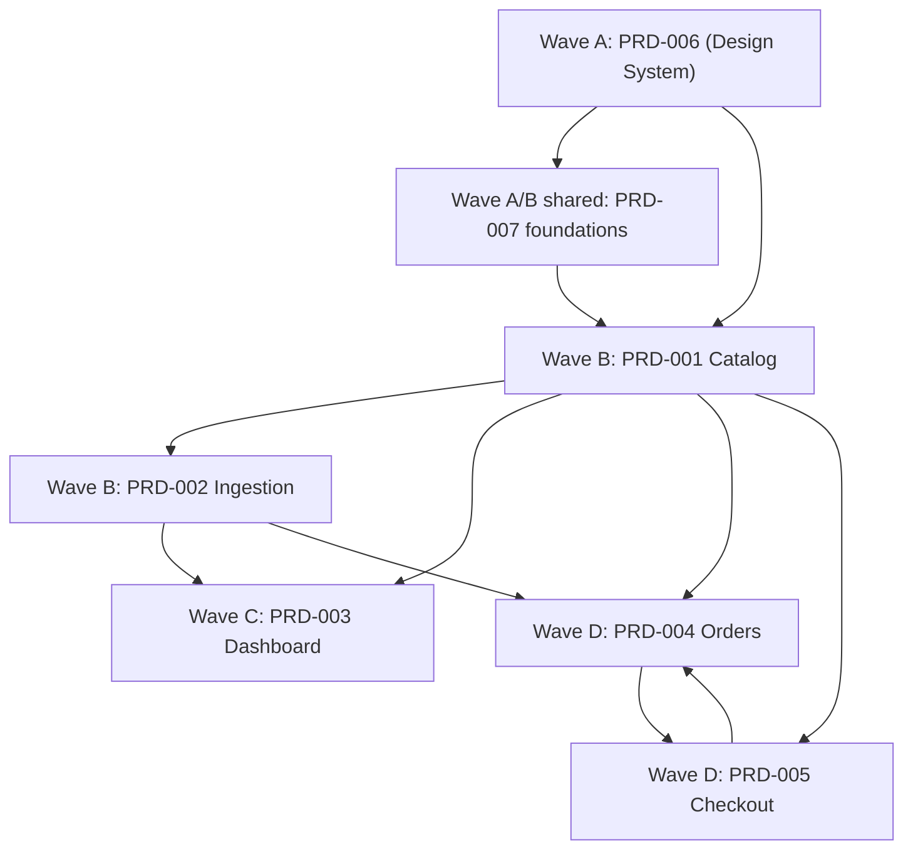

# Implementation Tracker

## Scope
- Source PRDs: `PRD-001` to `PRD-007`
- Task sets: `tasks-001` to `tasks-007`
- Owner: Codex
- Status legend: `pending`, `in_progress`, `done`, `blocked_external`

## Dependency DAG

## Contract-First Decision Log
- `PRD-004` and `PRD-005` circular dependency resolved by defining `orders`, `order_items`, and `create_order` RPC contract first (`004_orders.sql`, `007_create_order_rpc.sql`) and wiring triggers/functions afterward (`006_order_triggers.sql`, `order-confirm`, `order-alert-group`, `whatsapp-webhook`).
- Status vocabulary normalized to: `pending`, `confirmed`, `claimed`, `customer_contacted`, `out_for_delivery`, `delivered`, `completed`, `cancelled`.

## Task Matrix
| Task ID | Wave | Status | Owner | Dependencies | Evidence |
| --- | --- | --- | --- | --- | --- |
| 6.1 | A | done | Codex | none | `src/styles/tokens.css` |
| 6.2 | A | done | Codex | 6.1 | `src/styles/base.css` |
| 6.3 | A | done | Codex | 6.1 | `src/styles/utilities.css` |
| 6.4 | A | done | Codex | 6.1 | `src/assets/fonts/README.md`, page head preload links |
| 6.5 | A | done | Codex | 6.1,6.2 | `src/styles/components/button.css` |
| 6.6 | A | done | Codex | 6.1,6.2 | `src/styles/components/form.css` |
| 6.7 | A | done | Codex | 6.1,6.2 | `src/styles/components/card.css` |
| 6.8 | A | done | Codex | 6.1,6.2 | `src/styles/components/badge.css` |
| 6.9 | A | done | Codex | 6.1,6.2 | `src/styles/components/modal.css` |
| 6.10 | A | done | Codex | 6.1,6.2,6.5 | `src/styles/components/navbar.css`, `src/scripts/components/navbar.js` |
| 6.11 | A | done | Codex | 6.1,6.2 | `src/styles/components/footer.css`, `src/scripts/components/footer.js` |
| 6.12 | A | done | Codex | 6.1 | `src/styles/components/grid.css` |
| 6.13 | A | done | Codex | 6.1 | `src/styles/components/islamic-patterns.css`, `src/assets/patterns/*` |
| 6.14 | A | done | Codex | none | `src/assets/icons/lantern.svg` |
| 7.1 | A | done | Codex | none | `src/scripts/i18n.js`, `src/scripts/vendor-i18next-lite.js` |
| 7.2 | A | done | Codex | 7.1 | `src/locales/ar/common.json` |
| 7.3 | A | done | Codex | 7.1 | `src/locales/ar/products.json`, `checkout.json`, `errors.json`, `admin.json` |
| 7.4 | A | done | Codex | 7.1 | `src/scripts/i18n.js` DOM binding |
| 7.5 | A | done | Codex | none | `src/scripts/utils/format.js` |
| 7.6 | A | done | Codex | 6.10 | skip links in page templates |
| 7.7 | A | done | Codex | 6.10,6.11 | semantic landmarks in page templates |
| 7.8 | A | done | Codex | 6.9 | `src/scripts/utils/focus-trap.js`, `focus-ring.js` |
| 7.9 | A | done | Codex | 7.6,7.7 | cart badge/toast/error live regions |
| 7.10 | A | done | Codex | 7.6,7.7 | `tests/a11y/run-a11y.mjs` |
| 7.11 | A | done | Codex | 6.13 | `public/manifest.json`, app icons |
| 7.12 | A | done | Codex | 7.11 | `src/workers/sw.js` |
| 7.13 | A | done | Codex | 6.1,6.14 | `src/pages/offline.html` |
| 7.14 | A | done | Codex | 7.11,7.12 | `src/scripts/pwa.js` |
| 1.1 | B | done | Codex | none | `supabase/migrations/001_products.sql` |
| 1.2 | B | done | Codex | 1.1 | `supabase/migrations/002_rls_products.sql` |
| 1.3 | B | done | Codex | 1.1 | `supabase/migrations/003_fts.sql` |
| 1.4 | B | done | Codex | 1.1 | `supabase/seed.sql`, `src/assets/mock/catalog.json` |
| 1.5 | B | done | Codex | 1.4,6.5-6.12 | `src/pages/index.html`, `src/scripts/pages/home.js`, `src/styles/pages/home.css` |
| 1.6 | B | done | Codex | 1.3,1.4,6.7,6.12 | `src/pages/products.html`, `src/scripts/pages/products.js`, `src/styles/pages/products.css` |
| 1.7 | B | done | Codex | 1.4,6.5,6.7 | `src/pages/product.html`, `src/scripts/pages/product.js`, `src/styles/pages/product.css` |
| 1.8 | B | done | Codex | none | `src/scripts/services/cart.js` |
| 1.9 | B | done | Codex | 1.8,6.10 | `src/scripts/components/cart-badge.js`, `src/styles/components/cart-badge.css` |
| 1.10 | B | done | Codex | 1.8,6.5,6.7,6.14 | `src/pages/cart.html`, `src/scripts/pages/cart.js`, `src/styles/pages/cart.css` |
| 1.11 | B | done | Codex | 1.1 | `supabase/functions/optimize-image/index.ts` |
| 2.1 | B | done | Codex | none | Meta Cloud API live send `HTTP 200` accepted on 2026-02-12 (`hello_world`) |
| 2.2 | B | done | Codex | 2.1 | `supabase/functions/whatsapp-webhook/index.ts` |
| 2.3 | B | done | Codex | 2.1 | `supabase/functions/_shared/whatsapp.ts` |
| 2.4 | B | done | Codex | 2.2,1.1 | `supabase/functions/parse-product-link/index.ts` |
| 2.5 | B | done | Codex | 2.2,2.3,2.4 | `supabase/functions/whatsapp-webhook/index.ts` URL routing |
| 2.6 | B | done | Codex | 2.2,1.1 | `supabase/functions/parse-product-text/index.ts` |
| 2.7 | B | done | Codex | 2.1 | `supabase/functions/_shared/media.ts` |
| 2.8 | B | done | Codex | 2.6,2.7,2.3 | webhook manual flow |
| 2.9 | B | done | Codex | 2.6,2.8 | `_shared/conversation-state.ts`, `008_whatsapp_ingestion.sql` |
| 3.1 | C | done | Codex | 6.5,6.6 | `src/pages/admin/login.html`, `src/scripts/pages/admin/login.js`, `src/styles/pages/admin/login.css` |
| 3.2 | C | done | Codex | 3.1 | `src/scripts/services/auth.js`, `src/scripts/utils/auth-guard.js` |
| 3.3 | C | done | Codex | 3.2,1.1 | `src/pages/admin/dashboard.html`, `dashboard.js`, `dashboard.css` |
| 3.4 | C | done | Codex | 3.2,1.1,1.3 | `src/pages/admin/products.html`, `products.js`, `products.css` |
| 3.5 | C | done | Codex | 3.2,6.6,1.11 | `src/pages/admin/product-edit.html`, `product-edit.js`, `product-edit.css` |
| 3.6 | C | done | Codex | 3.2,1.1 | `src/pages/admin/categories.html`, `categories.js` |
| 3.7 | C | done | Codex | 6.10 | `src/scripts/components/admin-nav.js`, `src/styles/components/admin-nav.css` |
| 3.8 | C | done | Codex | 6.8 | `src/scripts/components/toast.js`, `src/styles/components/toast.css` |
| 4.1 | D | done | Codex | 1.1 | `supabase/migrations/004_orders.sql` |
| 4.2 | D | done | Codex | 4.1 | `supabase/migrations/005_rls_orders.sql` |
| 4.3 | D | blocked_external | Codex | 2.1 | `order_confirmation_ar_v1` submitted (ID `745518335018428`), status `PENDING` on 2026-02-12 |
| 4.4 | D | done | Codex | 4.1,4.3,2.3 | `supabase/functions/order-confirm/index.ts` |
| 4.5 | D | done | Codex | 4.1,4.4 | `supabase/migrations/006_order_triggers.sql` |
| 4.6 | D | done | Codex | 4.5,2.3 | `supabase/functions/order-alert-group/index.ts` |
| 4.7 | D | done | Codex | 4.1,2.2,4.6 | webhook claim command |
| 4.8 | D | done | Codex | 4.7 | webhook contact command |
| 4.9 | D | done | Codex | 4.1,2.2 | webhook status command |
| 4.10 | D | done | Codex | 4.7,4.8 | webhook deliver command |
| 5.1 | D | done | Codex | 2.1 | `supabase/functions/validate-whatsapp/index.ts` |
| 5.2 | D | done | Codex | 5.1 | `src/scripts/services/whatsapp-validate.js` |
| 5.3 | D | done | Codex | 6.5,6.6,1.8 | `src/pages/checkout.html`, `checkout.js`, `checkout.css` |
| 5.4 | D | done | Codex | 5.3,1.8 | checkout step 1 logic |
| 5.5 | D | done | Codex | 5.2,5.3,6.6 | checkout step 2 logic |
| 5.6 | D | done | Codex | 5.4,5.5 | checkout step 3 confirm logic |
| 5.7 | D | done | Codex | 4.1,1.1 | `supabase/migrations/007_create_order_rpc.sql` |
| 5.8 | D | done | Codex | 5.6,6.14 | `src/pages/order-confirmation.html`, `order-confirmation.js`, css |

## Verification Evidence (Rolling)
- 2026-02-11: `npm run lint` ✅ (`lint passed (168 files checked)`).
- 2026-02-11: `npm run test` ✅ (3/3 unit tests passed).
- 2026-02-11: `npm run test:e2e` ✅ (`e2e checks passed`).
- 2026-02-11: `npm run test:a11y` ✅ (`0 critical/serious issues in static audit`).
- 2026-02-11: `npm run build` ✅ (`build complete: dist/`).
- 2026-02-11: `npm run db:validate` ✅ (`db validation passed`).
- 2026-02-12: WhatsApp API live verification ✅ `hello_world` send accepted (`HTTP 200`) for phone ID `974121889122023`.
- 2026-02-12: Template status check ⚠️ `order_confirmation_ar_v1` is `PENDING` (ID `745518335018428`), not yet approved.

## External Blockers
- `4.3`: WhatsApp order confirmation template is submitted as `order_confirmation_ar_v1` and still awaiting Meta approval.
